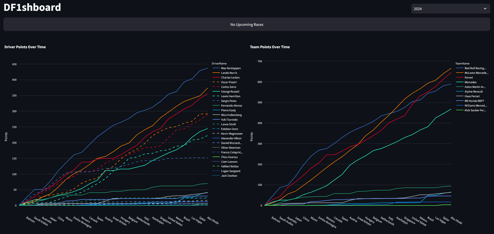
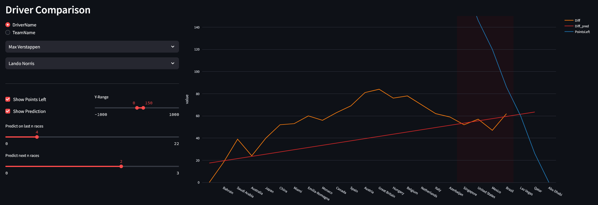
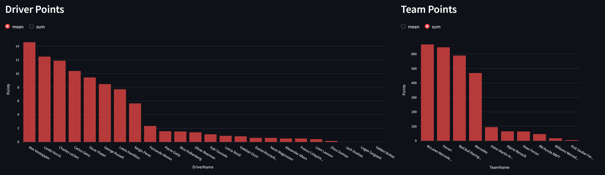
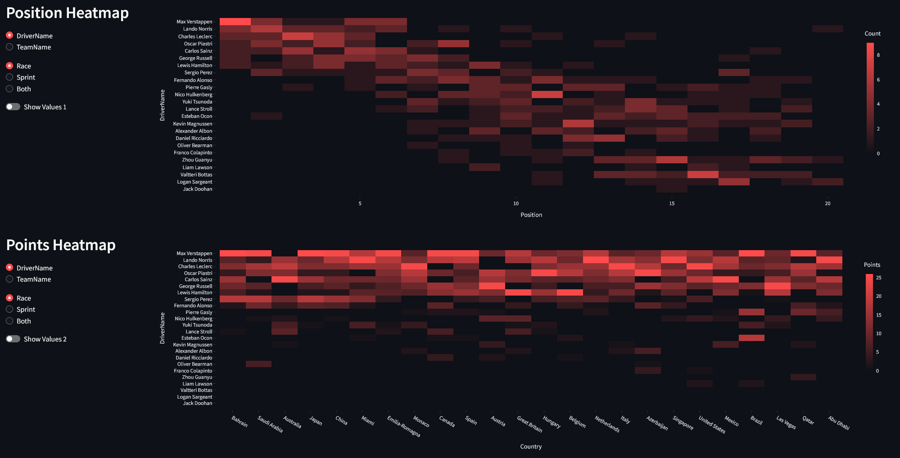

# df1sh
A simple dashboard to follow the formula 1 scores.

All points per Driver and Team at one glance!


Compare the two best players or teams!


Aggregated Point Summary!


And Heatmaps!


## Usage

To run the DF1shboard, follow these steps:

1. Ensure you have Python installed on your system.
2. Install the required dependencies by running:
    ```bash
    pip install -r requirements.txt
    ```
3. Start the Streamlit app by executing:
    ```bash
    streamlit run DF1shboard.py
    ```
4. Open your web browser and navigate to the URL provided by Streamlit to view the dashboard.